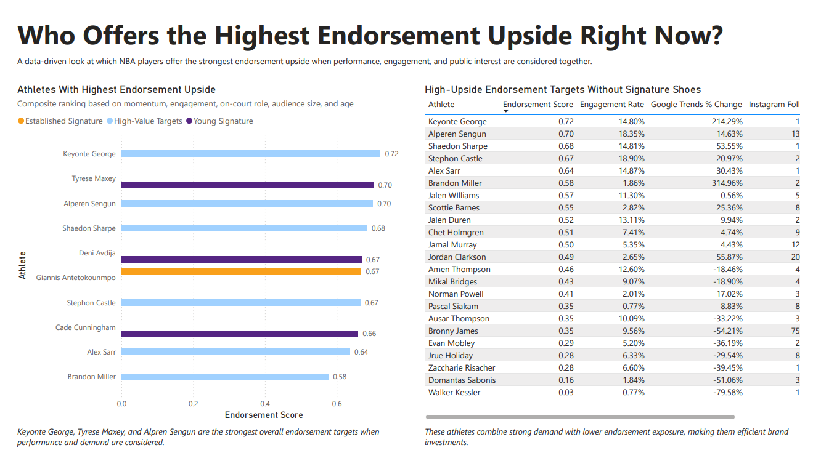
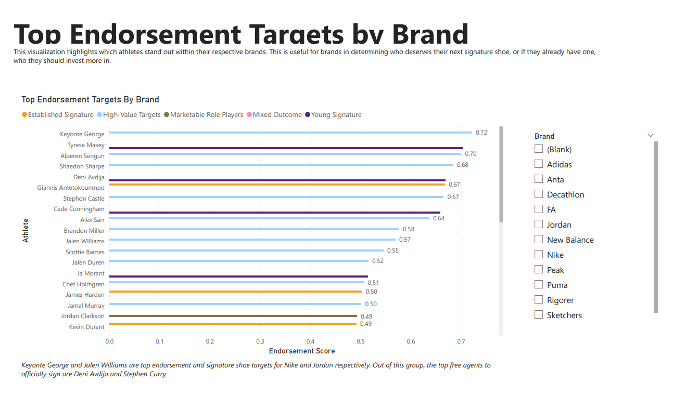
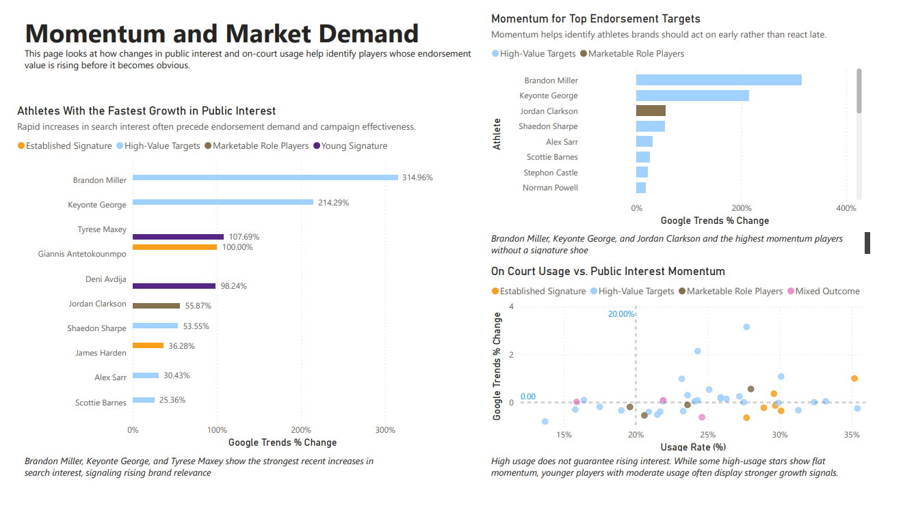
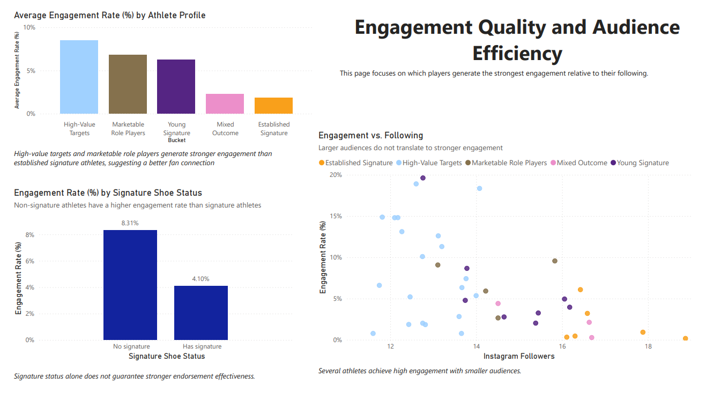
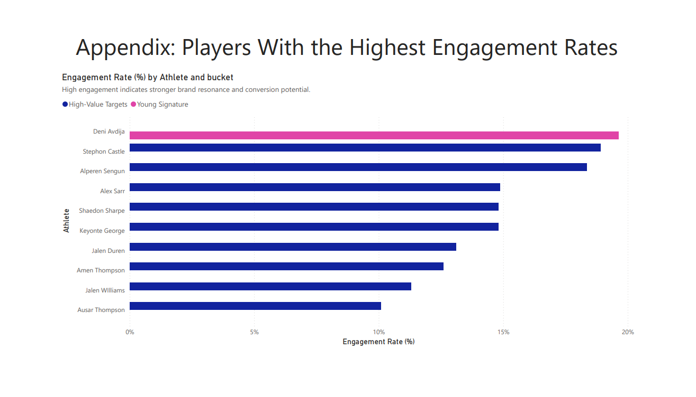
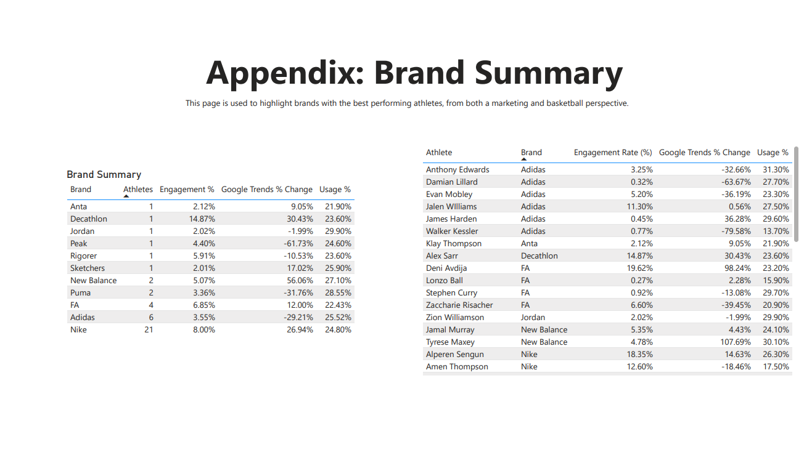

# NBA Athlete Endorsement Targeting Analysis
### A Data-Driven Look at Signature Shoe and Endorsement Upside

## TLDR

**Business Goal**  
Identify which NBA athletes offer the highest endorsement and signature shoe upside using performance, engagement, and public interest data, rather than relying on general hype or star status.

**Who This Is For**  
Athletic shoe brands such as Nike, Adidas, Puma, Anta, Jordan Brand, and similar companies making endorsement and signature shoe decisions.

**What I Built**
- A cleaned and structured endorsement dataset combining NBA performance data, Instagram engagement metrics, and Google Trends interest
- SQL views in Google BigQuery to normalize metrics and calculate a weighted endorsement score
- Athlete segmentation into realistic endorsement buckets such as established signatures, young signature bets, and high value targets without signature shoes
- A Power BI dashboard that tells a clear endorsement decision story across performance, momentum, engagement quality, and brand context

**Key Deliverables**
- Defined business question and client objective
- Documented data sources and collection process
- Cleaned and validated endorsement dataset
- SQL-based endorsement scoring and analytical views
- Power BI dashboard with narrative-driven visualizations
- Athlete bucket and segmentation analysis
- Brand specific endorsement insights
- Strategic takeaways and recommendations

## Links to Deliverables 

- **Power BI Dashboard**  
  Interactive dashboard with narrative-driven visualizations covering endorsement upside, momentum, engagement quality, and brand-specific views.
  - 
  - 

- ****  
  BigQuery SQL views used to normalize metrics and calculate the composite endorsement score.  

- ****  
  Cleaned and validated dataset used across SQL and Power BI analysis.  

- ****  
Images used to preview the Power BI dashboard.  
  

**Findings**
- Keyonte George, Alpren Sengun, Brandon Miller, Jalen Williams, and Scottie Barnes are the players with the highest endorsement upside. They are likely top candidates to receive signature shoes or more player-exclusive colorways in the near future. 
- Engagement rate and momentum matter more than raw follower count
- Several non-signature athletes show stronger growth signals than current signature holders
- Young players with rising usage and public interest represent strong long-term brand bets
- Some established endorsements show declining momentum despite large audiences

**Tools Used**
Python, SQL (BigQuery), Excel, Power BI

**Why It Matters**
This project models how brands actually make endorsement decisions under uncertainty and provides a reusable framework for athlete marketing, influencer targeting, and brand partnerships beyond basketball.

---

## Overview

I’ve always been interested in how certain NBA players end up with signature shoes or long-term footwear deals, even when they were not obvious superstars at the time. Players like Klay Thompson, Andrew Wiggins, and Donovan Mitchell do not hold the same gravity or influence as players like LeBron or Kevin Durant, yet brands took a chance with them and gave them their own signature shoes. 

That disconnect between star power and endorsement success is what initially pushed me to start this project.

Instead of looking back and asking why certain deals worked in hindsight, I wanted to understand how athletic shoe brands might spot those opportunities earlier. What signals actually matter when deciding which athletes are worth investing in long term, before the upside is obvious?

This project looks at NBA athletes through a mix of on-court performance data, social media engagement metrics, and public interest trends to identify which players and which types of players offer the highest endorsement upside right now. While the analysis focuses on basketball, the overall framework can be applied to other areas like influencer marketing, celebrity endorsements, and brand partnerships in different industries.

---

## Core Business Question

**Which NBA athletes or athlete profiles offer the highest endorsement upside for athletic shoe brands?**

This project intentionally avoids framing the question as “who should brands sign next.” In practice, most NBA players are already under exclusive endorsement contracts or receive player-exclusive colorways with their current brand. If the question were "who should brands sign next", this project would focus more on college, high school, and overseas stars. 

Instead, the analysis reflects how brands actually operate:

- Which athletes should receive deeper investment?
- Who is best positioned for signature shoe development?
- Which players represent high-ROI opportunities that are not yet fully saturated?
- Where is momentum building before it becomes obvious?

---

## Client Context

**Client Type**  
Athletic shoe companies such as Nike, Adidas, Puma, Anta, Jordan Brand, and similar brands.

**Business Objective**  
Support endorsement and marketing decision-making by identifying athletes with strong growth signals, engagement quality, and long-term brand value rather than relying solely on reputation or existing star status.

---

## Factors Considered

This project combines performance indicators with off-court audience signals to better reflect real endorsement decision-making.

Key factors include:

- Instagram engagement rate ((average likes + average comments)/total followers)*100)
- Audience growth and interaction 
- Google Trends momentum over time
- Usage rate, minutes, and on-court role
- Career stage and age

The goal is not to rank basketball skill or popularity, but to estimate endorsement potential.

---

## Athlete Selection Strategy

Athletes were selected across different career stages, endorsement situations, and levels of visibility. The goal was not to rank players by skill, but to reflect how brands actually look at the market when they make endorsement decisions.

Brands do not evaluate every athlete in isolation. They think in categories like proven stars, younger bets, high-value targets without signature shoes, and lower-cost marketing plays. The buckets/categories make it easier to compare similar types of athletes and avoid unrealistic comparisons between players at completely different points in their careers. A "Risk or Mixed Outcome" section was added as I wanted to decipher why lesser-known players were given their own signature shoes. 

To keep everything fair, all performance and popularity metrics were pulled from the same recent time window. 

Note: Some of the players in "Young Signature Bets" have not released their signature shoe just yet, however, it is almost guaranteed that they are coming out. For example, Deni Avdija is rumored to release a new shoe with Adidas in February of 2026. 

### Athlete Buckets

**Established Signature Athletes**  
LeBron James  
Kevin Durant  
Stephen Curry  
Damian Lillard  
Giannis Antetokounmpo  
James Harden  

**Young Signatures**  
Anthony Edwards  
Ja Morant  
Zion Williamson  
LaMelo Ball  
Cade Cunningham  
Tyrese Maxey  
Tyrese Haliburton  
Deni Avdija  

**High-Value Targets (No Signature Shoe)**  
Domantas Sabonis  
Alperen Sengun  
Jamal Murray  
Pascal Siakam  
Jrue Holiday  
Jalen Duren  
Chet Holmgren  
Scottie Barnes  
Evan Mobley  
Jalen Williams  
Brandon Miller  
Amen Thompson  
Ausar Thompson  
Keyonte George  

**Marketable Role Players / Undervalued Plays**  
Austin Reaves  
Mikal Bridges  
Jordan Clarkson  
Bronny James  

**Risk or Mixed Outcomes**  
Andrew Wiggins  
Lonzo Ball  
Klay Thompson  

---

## Data Sources

- [Google Trends](https://trends.google.com/trends/)
- [Social Blade](https://socialblade.com/instagram) for Instagram public metrics
- [Basketball Reference](https://www.basketball-reference.com/) for NBA player statistics
- [ESPN sneaker article](https://www.espn.com/espn/feature/story/_/id/39771146/sneakerhead-guide-every-nba-wnba-signature-sneaker-history) for historical signature shoe context
- Public endorsement and signature shoe history through Google 

---

## Data Collection and Preparation

### Web Scraping and Extraction

Python was used to extract endorsement-related data:

- `requests` to retrieve web content  
- `BeautifulSoup4` to parse HTML  
- `pandas` to clean and structure data  

Extracted information included athlete names, shoe lines, brands, leagues, and time periods. Cleaned datasets were exported to CSV files for SQL analysis and visualization.

### Manual Validation

Certain metrics, especially engagement rate calculations and Google Trends comparisons, required manual validation to ensure consistent time windows and realistic comparisons. This tradeoff was intentional to prioritize data quality over full automation.

---

## Data Cleaning Challenges

### TL;DR

- Data came from multiple sources, so significant time went into making metrics comparable  
- BigQuery schema issues required manual data type definitions  
- Percentage formatting inconsistencies caused visualization issues in Power BI  
- Raw follower counts were misleading without engagement context  
- The business question was reframed mid-project to better reflect real brand behavior  

This project involved more hands-on data cleaning than I initially expected. Because the data came from multiple sources (web scraping, manual tracking, and public datasets), a lot of the work was about making sure numbers actually meant the same thing before comparing them.

One of the first issues I ran into was schema conflicts when loading data into BigQuery. Some fields were being inferred incorrectly, especially percentages and numeric columns pulled from CSV exports. Instead of relying on auto-detection, I manually defined the schema and validated each column to avoid silent type errors that would affect downstream calculations.

Another recurring issue was inconsistent percentage formatting. Some metrics were stored as decimals, others as percentages, and a few changed formats between tools. I normalized these values in Power Query, then double-checked them again in Power BI’s model view after noticing visuals still rendering decimals instead of percentages. That extra validation step ended up catching multiple formatting issues that would have gone unnoticed otherwise.

Social media metrics introduced their own problems. Raw follower counts were heavily skewed toward established stars, which made it hard to compare newer or less visible players. To avoid overstating popularity, I shifted the analysis toward engagement rate rather than total followers.

Finally, there was a framing issue that emerged mid-project. I initially approached the analysis as “which athletes should brands sign next,” but that didn’t reflect how endorsement deals actually work. I reworked the question to focus on endorsement upside instead: identifying which athletes brands should invest in more deeply through signature shoes, expanded marketing, or long-term positioning.

---

## Analysis Approach

The analysis is driven by SQL views built in Google BigQuery. Percentile-based normalization was used to compare athletes across metrics with different scales.

A weighted endorsement score was created to reflect how brands balance:

- Momentum and engagement  
- On-court role
- Audience size  
- Age

This mirrors real-world endorsement decision-making more closely than pure performance rankings.

---

## Power BI Visualizations

The final output is a multi-page Power BI dashboard designed to tell a clear endorsement targeting story.

### Executive Overview

### Top Endorsement Targets by Brand

### Momentum and Market Demand

### Engagement Quality and Audience Efficiency

### Appendix: Highest Engagement Rates

### Appendix: Brand Summary

---

## Deliverables

1. Clear definition of the business task and client objective  
2. Documented data sources and collection methods  
3. Cleaned and structured endorsement dataset  
4. SQL-based analytical views and scoring logic  
5. Power BI dashboard with narrative-driven visualizations  
6. Athlete segmentation and bucket analysis  
7. Brand-specific endorsement targeting insights  
8. Strategic takeaways and recommendations for future analysis  

---

## Key Takeaways

- Engagement and momentum often matter more than raw follower count. This was proven through the "Risk and Mixed Outcomes" bucket as players such as Lonzo Ball and Andrew Wiggins had lower engagement.   
- Several non-signature athletes show stronger growth signals than current signature holders; NBA fans tend to gravitate towards newer players in terms of fan interaction via social media. 
- Young players with high usage and rising public interest represent strong long-term endorsement bets. Lamelo Ball was the number one player for high usage and public interest.  
- Some established endorsements show declining momentum despite large audiences. Players like James Harden and Damian Lillard are declining in popularity, most likely due to their athletic primes fading. 

---

## Why This Project Matters

Endorsement decisions are bets made under uncertainty. This project focuses on reducing that uncertainty by combining performance, audience behavior, and public interest signals into a single analytical framework.

The same logic applies beyond basketball — anywhere brands need to decide who to invest in before the upside is obvious.

---

## Future Improvements and Extensions

If I were to do this project again or continue building on it, the next thing I would want to add is historical signature shoe sales data. Being able to see how past signature shoes actually performed would help connect endorsement signals to real business outcomes and show how well popularity and engagement translate into revenue.

I thought about including this during the project, but reliable sales data is hard to find and would have taken a significant amount of time to collect and clean properly. Instead of rushing that part or relying on rough estimates, I chose to focus on building a solid endorsement targeting framework using performance data, engagement metrics, and public interest trends.

If this were expanded further, other directions I would explore include:
- Comparing endorsement scores to known signature shoe performance where data is available
- Looking at changes in engagement and search interest before and after signature shoe launches
- Expanding the analysis to other leagues like the WNBA or NCAA
- Applying the same approach to non-sports endorsements, such as influencers or entertainers

I intentionally kept the project focused on how brands decide who to invest in before sales results are available. Adding sales data later would help confirm those decisions, but the main framework still works on its own.

---

## What I Learned

This project strengthened my ability to:

- Translate open-ended business questions into measurable analytical problems  
- Work through real-world data quality issues instead of ideal datasets  
- Balance automation with manual validation when accuracy matters  
- Use SQL not just for querying, but for modeling business decisions  
- Communicate analysis in a way that reflects how brands actually operate
- Strengthened my Power BI, visualization, and data storytelling skills

